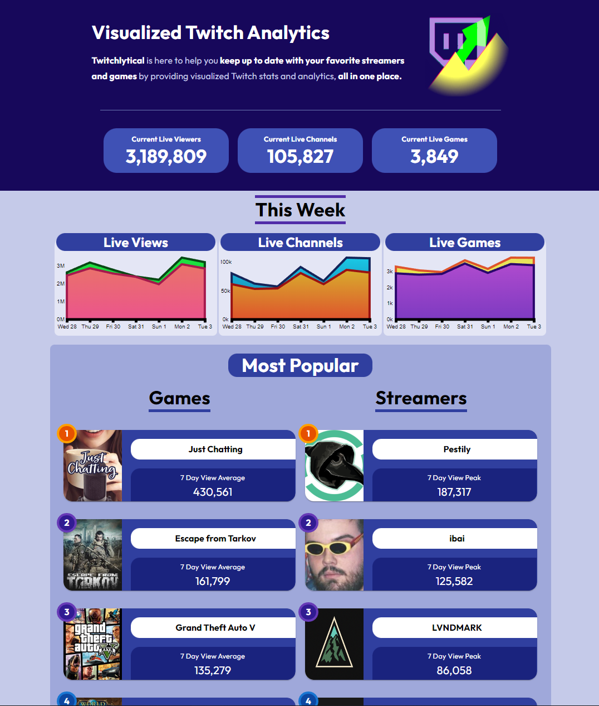
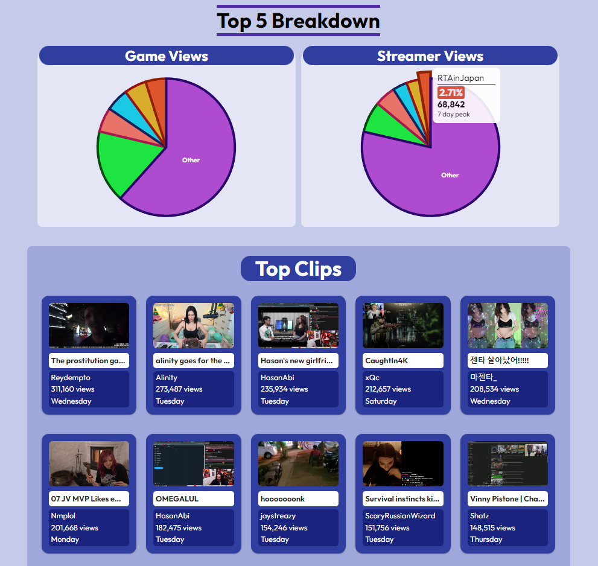
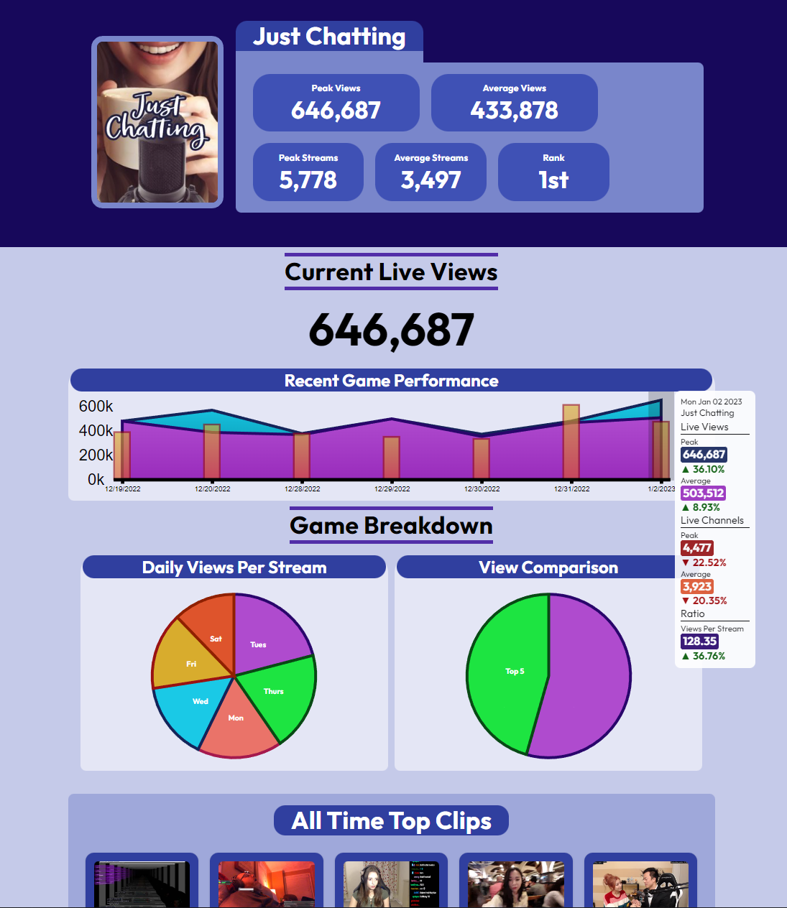

# Work In Progress

This project is currently a work in progress.

Twitchlytical tracks and visualizes data from Twitch.tv

# Technologies Used

This project is currently using TypeScript, JavaScript, React, Twitch API, D3, GraphQL, MongoDB, Apollo-Client, Express, and Material UI

# Screenshots

